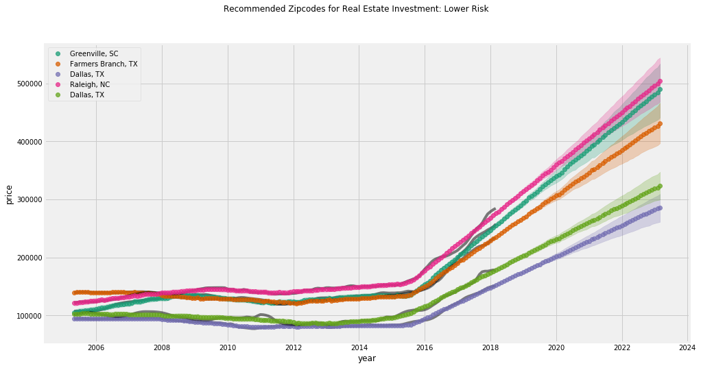

# Zillow Housing Predictions

## Import necessary packages, classes, and functions


```python
import pandas as pd
import matplotlib
from matplotlib import pyplot as plt
from sklearn import metrics
import math
from python.predictor import model_price, create_zip_df, plot_models

%matplotlib inline
plt.style.use('fivethirtyeight')
```

    ERROR:fbprophet:Importing plotly failed. Interactive plots will not work.


## Import data from Zillow Research


```python
all_df = pd.read_csv('raw_data/zillow_data.csv')
```

## Test error on specific zipcodes for data cleaning purposes


```python
_, _, training_forecast, _ = model_price(all_df, 79936, '2005-04-01', '2016-04-01')
math.sqrt(metrics.mean_squared_error(create_zip_df(all_df, 79936,'2016-04-01', '2018-04-01')['y'],
                           training_forecast.loc[((training_forecast['ds'] > '2016-05-01') & (training_forecast['ds'] < '2018-05-01')), 'yhat']))
```


    1866.780790141378


## Manipulate data into desired groups


```python
no_nan_df = pd.concat([all_df['RegionName'], all_df.loc[:, '2005-04': '2018-04']], axis=1).dropna()
```


```python
stats_df = pd.read_csv('raw_data/stats.csv')
```


```python
filtered_stats_df = stats_df.loc[stats_df['zipcode'].isin(no_nan_df['RegionName'])]

```

## Gather top 5 zipcodes and define for conservative ROI (low risk), expected ROI (highest expecte ROI by median), and high potential ROI (max ROI potential).


```python
conservative5 = filtered_stats_df.nlargest(5, 'min_roi')
conservative5
```


<div>
<style scoped>
    .dataframe tbody tr th:only-of-type {
        vertical-align: middle;
    }

    .dataframe tbody tr th {
        vertical-align: top;
    }

    .dataframe thead th {
        text-align: right;
    }
</style>
<table border="1" class="dataframe">
  <thead>
    <tr style="text-align: right;">
      <th></th>
      <th>Unnamed: 0</th>
      <th>zipcode</th>
      <th>2018-04-01</th>
      <th>minimum</th>
      <th>min_roi</th>
      <th>expected</th>
      <th>expected_roi</th>
      <th>maximum</th>
      <th>max_roi</th>
    </tr>
  </thead>
  <tbody>
    <tr>
      <td>6698</td>
      <td>0</td>
      <td>29601.0</td>
      <td>258638.364509</td>
      <td>443344.806296</td>
      <td>0.714149</td>
      <td>489904.265675</td>
      <td>0.894167</td>
      <td>534706.042342</td>
      <td>1.067389</td>
    </tr>
    <tr>
      <td>3157</td>
      <td>0</td>
      <td>75234.0</td>
      <td>238714.471709</td>
      <td>398796.551429</td>
      <td>0.670601</td>
      <td>431148.939508</td>
      <td>0.806128</td>
      <td>470908.002437</td>
      <td>0.972683</td>
    </tr>
    <tr>
      <td>3795</td>
      <td>0</td>
      <td>75224.0</td>
      <td>154626.016415</td>
      <td>258311.031721</td>
      <td>0.670553</td>
      <td>286294.568517</td>
      <td>0.851529</td>
      <td>309818.769862</td>
      <td>1.003665</td>
    </tr>
    <tr>
      <td>7981</td>
      <td>0</td>
      <td>27601.0</td>
      <td>279042.267747</td>
      <td>463695.028026</td>
      <td>0.661738</td>
      <td>503906.684333</td>
      <td>0.805844</td>
      <td>540607.696879</td>
      <td>0.937368</td>
    </tr>
    <tr>
      <td>5323</td>
      <td>0</td>
      <td>75235.0</td>
      <td>180698.814712</td>
      <td>298489.913875</td>
      <td>0.651864</td>
      <td>323096.247915</td>
      <td>0.788037</td>
      <td>349234.995235</td>
      <td>0.932691</td>
    </tr>
  </tbody>
</table>
</div>


```python
filtered_stats_df.nlargest(5, 'expected_roi')
```


<div>
<style scoped>
    .dataframe tbody tr th:only-of-type {
        vertical-align: middle;
    }

    .dataframe tbody tr th {
        vertical-align: top;
    }

    .dataframe thead th {
        text-align: right;
    }
</style>
<table border="1" class="dataframe">
  <thead>
    <tr style="text-align: right;">
      <th></th>
      <th>Unnamed: 0</th>
      <th>zipcode</th>
      <th>2018-04-01</th>
      <th>minimum</th>
      <th>min_roi</th>
      <th>expected</th>
      <th>expected_roi</th>
      <th>maximum</th>
      <th>max_roi</th>
    </tr>
  </thead>
  <tbody>
    <tr>
      <td>4135</td>
      <td>0</td>
      <td>33563.0</td>
      <td>1.528269e+05</td>
      <td>2.206014e+05</td>
      <td>0.443472</td>
      <td>2.917412e+05</td>
      <td>0.908965</td>
      <td>3.627985e+05</td>
      <td>1.373918</td>
    </tr>
    <tr>
      <td>6698</td>
      <td>0</td>
      <td>29601.0</td>
      <td>2.586384e+05</td>
      <td>4.433448e+05</td>
      <td>0.714149</td>
      <td>4.899043e+05</td>
      <td>0.894167</td>
      <td>5.347060e+05</td>
      <td>1.067389</td>
    </tr>
    <tr>
      <td>3795</td>
      <td>0</td>
      <td>75224.0</td>
      <td>1.546260e+05</td>
      <td>2.583110e+05</td>
      <td>0.670553</td>
      <td>2.862946e+05</td>
      <td>0.851529</td>
      <td>3.098188e+05</td>
      <td>1.003665</td>
    </tr>
    <tr>
      <td>2596</td>
      <td>0</td>
      <td>32211.0</td>
      <td>1.410498e+05</td>
      <td>2.119523e+05</td>
      <td>0.502677</td>
      <td>2.591417e+05</td>
      <td>0.837235</td>
      <td>3.016168e+05</td>
      <td>1.138371</td>
    </tr>
    <tr>
      <td>191</td>
      <td>0</td>
      <td>7302.0</td>
      <td>1.525514e+06</td>
      <td>2.476980e+06</td>
      <td>0.623702</td>
      <td>2.802050e+06</td>
      <td>0.836791</td>
      <td>3.142064e+06</td>
      <td>1.059676</td>
    </tr>
  </tbody>
</table>
</div>


```python
filtered_stats_df.nlargest(5, 'max_roi')
```


<div>
<style scoped>
    .dataframe tbody tr th:only-of-type {
        vertical-align: middle;
    }

    .dataframe tbody tr th {
        vertical-align: top;
    }

    .dataframe thead th {
        text-align: right;
    }
</style>
<table border="1" class="dataframe">
  <thead>
    <tr style="text-align: right;">
      <th></th>
      <th>Unnamed: 0</th>
      <th>zipcode</th>
      <th>2018-04-01</th>
      <th>minimum</th>
      <th>min_roi</th>
      <th>expected</th>
      <th>expected_roi</th>
      <th>maximum</th>
      <th>max_roi</th>
    </tr>
  </thead>
  <tbody>
    <tr>
      <td>2409</td>
      <td>0</td>
      <td>33404.0</td>
      <td>137212.816327</td>
      <td>116412.847291</td>
      <td>-0.151589</td>
      <td>247852.017539</td>
      <td>0.806333</td>
      <td>383534.044138</td>
      <td>1.795177</td>
    </tr>
    <tr>
      <td>3342</td>
      <td>0</td>
      <td>95210.0</td>
      <td>247781.881136</td>
      <td>129969.311582</td>
      <td>-0.475469</td>
      <td>377423.557260</td>
      <td>0.523209</td>
      <td>639428.097098</td>
      <td>1.580609</td>
    </tr>
    <tr>
      <td>4149</td>
      <td>0</td>
      <td>48506.0</td>
      <td>21338.510102</td>
      <td>4699.588027</td>
      <td>-0.779760</td>
      <td>29668.391848</td>
      <td>0.390368</td>
      <td>55042.141680</td>
      <td>1.579474</td>
    </tr>
    <tr>
      <td>4436</td>
      <td>0</td>
      <td>33936.0</td>
      <td>136771.343623</td>
      <td>102384.722369</td>
      <td>-0.251417</td>
      <td>230583.865098</td>
      <td>0.685908</td>
      <td>352329.559760</td>
      <td>1.576048</td>
    </tr>
    <tr>
      <td>1154</td>
      <td>0</td>
      <td>33068.0</td>
      <td>218786.911781</td>
      <td>190830.148417</td>
      <td>-0.127781</td>
      <td>374135.226080</td>
      <td>0.710044</td>
      <td>561376.101551</td>
      <td>1.565858</td>
    </tr>
  </tbody>
</table>
</div>


## Make forecasts for modeling specifying dates and zipcode categories for plotting


```python
conservative_zip_forecasts = {}
for zipcode in conservative5['zipcode'].values:
    _, history_df, forecast_df, zipcode = model_price(all_df, zipcode, '2005-04-01', '2018-04-01')
    conservative_zip_forecasts[zipcode] = {'history': history_df, 'forecast': forecast_df}
```

## Plot desired forecasts


```python
plot_models(all_df, stats_df, conservative_zip_forecasts, 'Lower Risk')
```





```python

```


```python

```
